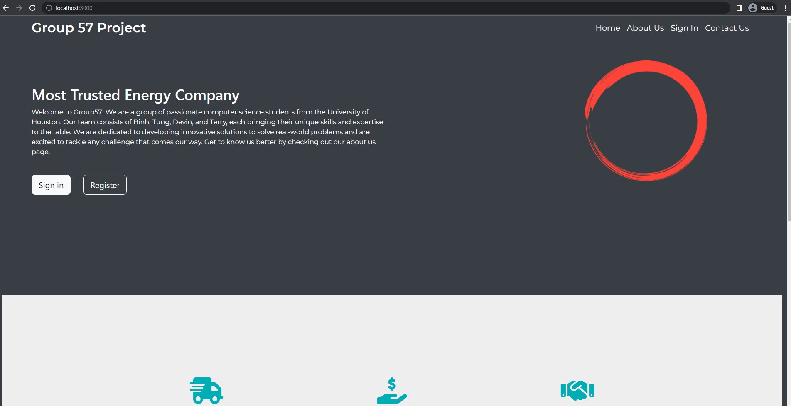

# Fuel Quote Web App

This is the repository for the Group57's project for COSC 4353 - Software Design.

## Introduction
A software application that will predict the rate of the fuel based on the following criteria:
- Client Location (in-state or out-of-state)
- Client history (existing customer with previous purchase or new)
- Gallons requested
- Company profit margin (%)

## Author
- Binh Nguyen 
- Tung Dinh
- Devin Kulatunga
- Terry Hoang

## Technologies Used
```List
Front-end:
   -EJS
   -Bootstrap
Back-end:
  - Node.js
  - Express.js
Database:
  - MongoDB
```

## Installation

Install dependencies using npm install

```bash
npm install 
```

## Usage

```javascript
# Step 1 - to start the application, go to terminal
Node app.js

#Step 2 - go to your browser 
Open http://localhost:3000 to view it in the browser.

```


